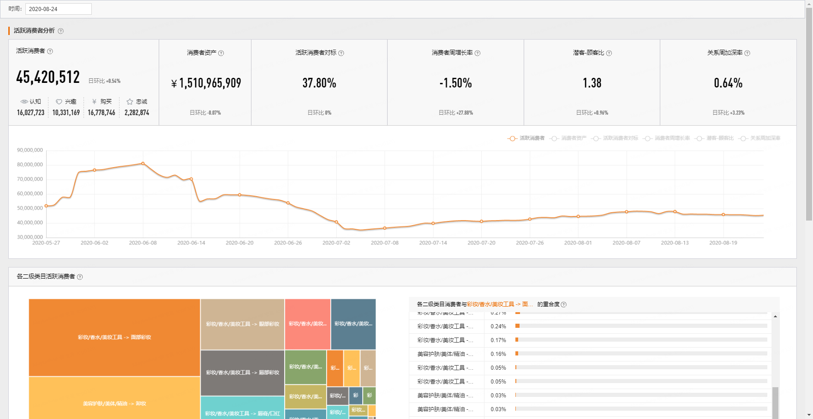

# 消费者分析 {#customeranalysis}


```{r echo = FALSE, out.width = "85%"}

```

## 内容

在消费者分析模块，你将熟悉AIPL人群，如何用AIPL人群计算更复杂的指数。


## 活跃消费者

 __定义:__ 品牌当前有效的`认知（15天）`、`兴趣（15天）`、`购买（2年半）`、`忠诚（1年）`的消费者总数。


```{r, eval=FALSE}

# 应用：FAST分析，Fertility即等于AIPL总和。

```

## 消费者资产

 __定义:__ 品牌最近365天的消费者未来3年内将为品牌带来的`GMV预测值`。预测的GMV是根据消费者总量、消费者的品类购买力、消费者转化力计算出来的。当选择全部类目时，预测的是消费者在品牌全部类目下的GMV；当选择单一类目时，预测的是品牌在该类目的消费者在对应类目下的GMV。


```{r, eval=FALSE}

# 应用：GMV 拆解

```

## 活跃消费者对标

 __定义:__ （品牌维度）与行业第一的品牌对比。品牌所在行业的消费者人数 / 该行业下第一名品牌的消费者人数。（二级类目维度）与二级类目下第一的品牌对比。
 品牌在所选二级类目下的消费者人数 /该二级类目下第一名品牌的消费者人数。计算结果会做模糊处理。
 
## 消费者周增长率

 __定义:__ 
$$
（当天品牌的消费者人数-上周同一天该人数）/上周同一天该人数
$$
 
## 潜客-顾客比

 __定义:__ 品牌未购买消费者人数（认知+兴趣） / 已购买消费者人数（购买+忠诚）
 
## 关系周加深率

 __定义:__ 
 从上周同一天到当天，
 关系周加深率 = 关系加深消费者人数 / 上周同一天品牌消费者总人数。关系加深指的是，认知流转到兴趣，兴趣流转到忠诚等，与品牌距离拉近的流转
 
## 各二级类目活跃消费者	

 __定义:__ 可以分析您品牌下各二级类目的活跃消费者占比，以及彼此的重合度，有助于做跨类目营销。
 
## 各二级类目与所选二级类目的活跃消费者重合度	

 __定义:__ 各二级类目与所选二级类目的活跃消费者重合度 = 重合的消费者人数 / 所选二级类目的活跃消费者人数


