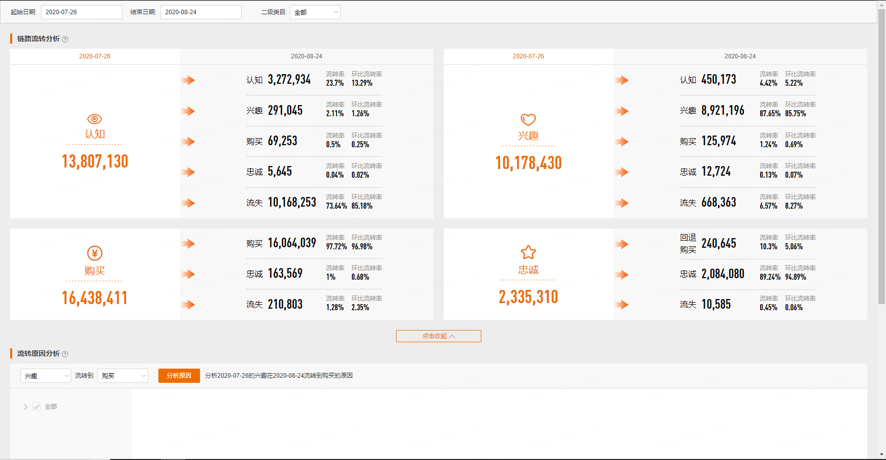

# 链路流转分析 {#linkflow}

```{r echo = FALSE, out.width = "85%"}

```


## 链路流转分析	

 __定义:__ 分析起始日期的消费者到截止日期当天发生流转的人数
*环比流转率*：所选周期前一个周期的流转率，例如，20181205-20181207的环比流转率为20181203-20181205的流转率


```{}
# 应用
FAST分析中的A(Advancing)，即AIPL周关系加深率。从首日到第七日，关系加深消费者人数 / 首日品牌消费者总人数。
关系加深指的是，A流转到IPL，I流转到PL，P流转到L。

```
