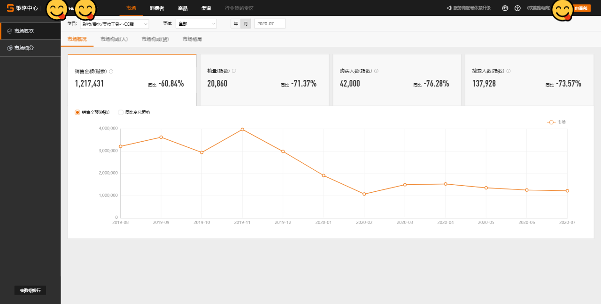

# 品牌增长览概{#growth}

```{r echo = FALSE, out.width = "85%"}

```


## 销售金额	

在所选条件下，品牌总的成交金额


## 购买人数	

在所选条件下，品牌总的购买人数(去重）。隐私保护提示：为了保护用户隐私，如下分析涉及到人数的指标均进行小噪声注入


## 人均购买叶子类目数	

在所选条件下，品牌购买人群平均购买的叶子类目数量


## 客单价	

在所选条件下，品牌购买人群平均购买的金额；客单价保留两位小数，四舍五入，因此购买人数*客单价得到金额和和页面上所给出的销售金额指标有一定差别


## 新品销售金额	

在所选条件下，品牌下的新品总的成交金额。这里的新品指自商品在天猫首次上架之日起在特定时间范围内，且未参加“极速抢、每日必买、聚划算品牌清仓、每日必买（买就返）”等营销活动或频道的商品


## 新品购买人数	

在所选条件下，品牌下的新品总的购买人数(去重）


## 品类老客购买详情

在所选条件下，有过品牌商品购买行为且之前365天没有发生过品牌商品行为的消费者，在之前365天购买品类下其他各品牌的人数（去重）


## 增长地图分析	

大快消策略人数在销售金额和购买人数上的变化趋势


## 品类增长分析	

分析品牌下各类目的增长情况，仅展示所选范围下的Top20二级类目/叶子类目，选择品牌全部类目时，展示Top20二级类目，选择二级类目时，展示Top20叶子类目

