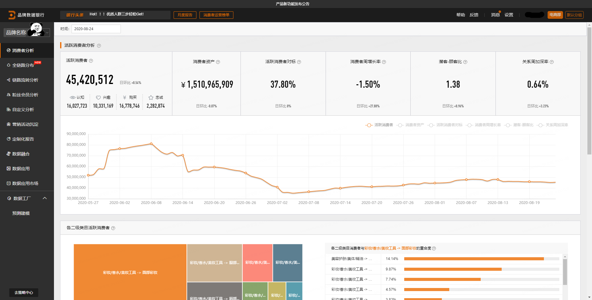

# (PART) 品牌数据银行 {-}


```{r echo = FALSE, out.width = "100%"}

```

阿里的品牌数据银行目前主要有10个模块，这份手册按照以下各部分来说明:  

- 消费者分析
- 全链路分布 
- 链路流转分析
- 粉丝会员分析

数据银行除了面板上直观的可视化数据展示，还有更加灵活和复杂的数据提取功能：

- 自定义分析
- 营销活动沉淀
- 定制化报告
- 数据融合
- 数据应用
- 数据应用市场
