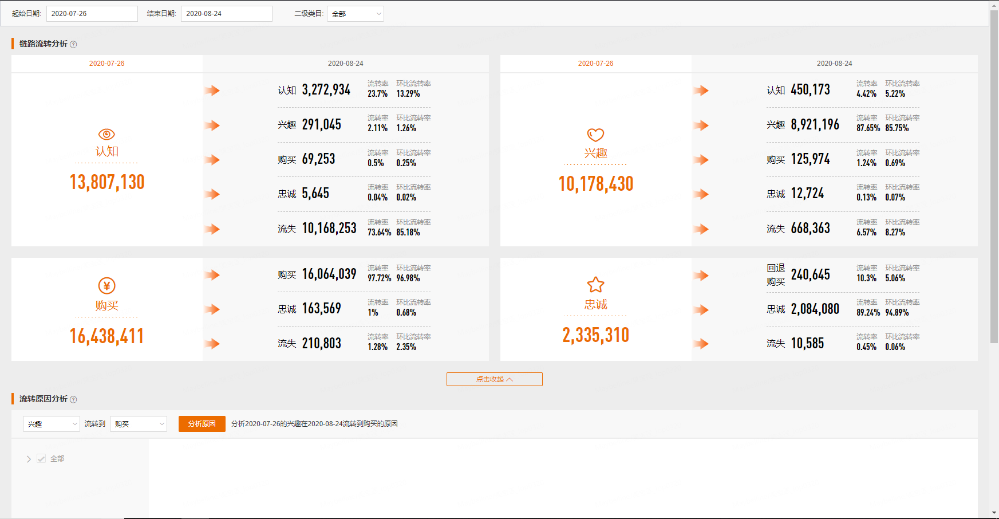
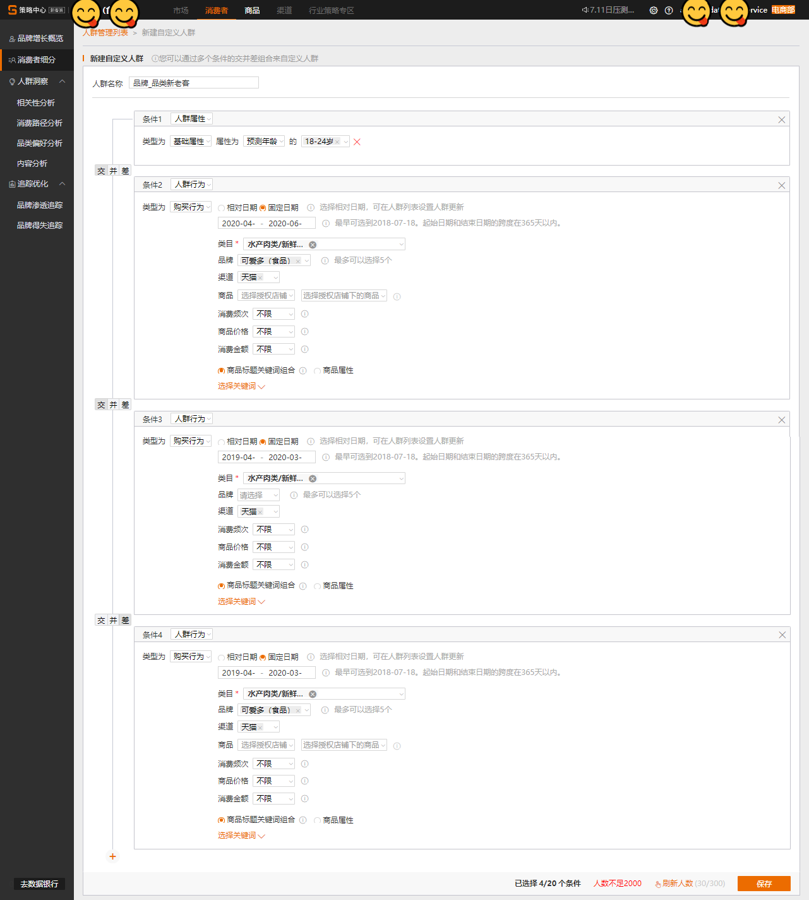

# (APPENDIX) Appendix {-} 


# 数据银行

## 消费者分析 {#customeranalysis}

```{r echo = FALSE, out.width = "100%"}
knitr::include_graphics("images/databank-customer.png")
```


- 活跃消费者

**定义:**品牌当前有效的`认知（15天）`、`兴趣（15天）`、`购买（2年半）`、`忠诚（1年）`的消费者总数。


- 消费者资产

**定义:**品牌最近365天的消费者未来3年内将为品牌带来的`GMV预测值`。预测的GMV是根据消费者总量、消费者的品类购买力、消费者转化力计算出来的。当选择全部类目时，预测的是消费者在品牌全部类目下的GMV；当选择单一类目时，预测的是品牌在该类目的消费者在对应类目下的GMV。


```{r, eval=FALSE}

# 应用：GMV 拆解

```

- 活跃消费者对标

**定义:**（品牌维度）与行业第一的品牌对比。品牌所在行业的消费者人数 / 该行业下第一名品牌的消费者人数。（二级类目维度）与二级类目下第一的品牌对比。
 品牌在所选二级类目下的消费者人数 /该二级类目下第一名品牌的消费者人数。计算结果会做模糊处理。
 
- 消费者周增长率

**定义:**
$$
（当天品牌的消费者人数-上周同一天该人数）/上周同一天该人数
$$
 
- 潜客-顾客比

**定义:**

$$
品牌未购买消费者人数（认知+兴趣） / 已购买消费者人数（购买+忠诚）
$$

- 关系周加深率

**定义:**
 从上周同一天到当天，
$$
 关系周加深率 = 关系加深消费者人数 / 上周同一天品牌消费者总人数。
$$
**关系加深**指的是，认知流转到兴趣，兴趣流转到忠诚等，与品牌距离拉近的流转

- 各二级类目活跃消费者	

    **定义:**可以分析您品牌下各二级类目的活跃消费者占比，以及彼此的重合度，有助于做跨类目营销。
 
- 各二级类目与所选二级类目的活跃消费者重合度	

    **定义:**各二级类目与所选二级类目的活跃消费者重合度 = 重合的消费者人数 / 所选二级类目的活跃消费者人数


## 全链路分布{#fulllinks}

> AIPL 人数

```{r echo = FALSE, out.width = "100%"}
knitr::include_graphics("images/databank-link.png")
```


- Aware 认知

    消费者 **相对被动** 与品牌接触。包括:

    - **曝光&点击**: 
    1. 15天内，被阿里妈妈广告曝光过或点击过阿里妈妈广告；
    2. 或被优酷广告曝光过；
    3. 或被超级品牌日天猫手机客户端的资源位曝光过；
    4. 或被欢聚日活动曝光过；
    5. 或被聚划算曝光过；
    6. 或被淘抢购曝光过；
    7. 或被手淘导购平台（有好货、生活研究所）的商品曝光过；
    8. 或点击过必买清单的商品；
    9. 或点击过猜你喜欢的商品；
    10. 或被淘宝头条内容曝光过（阅读了淘宝头条文章）；
    11. 或被微淘内容曝光过；
    12. 或被天猫快闪店的品牌活动曝光；
    13. 或被天合计划资源曝光或点击（包括，天合代币置换站内资源曝光点击人群，流量宝流量反哺曝光点击人群，TOP计划曝光点击人群）；
    14. 摇一摇曝光。
    
    - **浏览**: 
    1. 15天内，浏览了品牌号站点页面；
    2. 或浏览了互动吧页面；
    3. 或浏览过超级品牌日活动页；
    4. 或浏览过天猫超市大牌狂欢活动页；
    5. 或在试用中心浏览过品牌商品；
    6. 或发生过无品牌倾向搜索且点击；
    7. 或浏览过品牌旗舰店；
    8. 或浏览过1次品牌商品；
    9. 或浏览iStore小程序主页。
  
    - **观看**: 15天内，观看过淘宝短视频，或观看过品牌的直播。
    - **注意**: 品牌属性的触点只会归属品牌AIPL，不会归属二级类目AIPL，例如，以下触点（付费广告，品牌号，超级品牌日，欢聚日，直播，淘宝头条，微淘，天合计划，线下门店，快闪店，智能母婴室）的消费者仅归属品牌AIPL，不会归属二级类目AIPL。"


- Interest 兴趣

    消费者**主动**与品牌发生接触。包括:
    - **会员**: 品牌号会员；品牌授权店铺的会员。
    - **粉丝**: 品牌号订阅粉丝。
    互动吧关注粉丝；微淘粉丝（同收藏了授权店铺）。即只要处于会员或粉丝状态就属于兴趣。
    - **互动**: 
        - 15天内，参与了品牌号互动（预约了品牌服务）；
        - 在**品牌互动吧**有以下互动行为（预约核销成功，领取了新享样品，完成了新零售订单，擂台答题成功，参与乐透抽奖，参与新零售贩卖机互动，参与60s课堂）；
        - 在**试用中心**申请过品牌商品试用；
        - 参与了淘宝头条互动（对淘宝头条内容进行了评论、点赞、分享、收藏、参与过淘宝头条的提问、投票）；
        - 参与了**微淘**互动（对微淘内容进行了评论、点赞、收藏、转发）；
        - 参与了**天猫快闪店**的品牌互动；发生了有品牌倾向搜索；
        - **淘宝彩蛋**分享扫码；
        - 参与了**天猫母婴室**互动（领样、加会员粉丝）。
    - **浏览**: 15天内，浏览过大于等于2天品牌商品。
    - **收藏/加购**：15天内，收藏/加购过品牌商品的消费者；预售付定金。
    - **领取试用装**: 15天内，在菜鸟驿站领取了试用装；在线下门店随身购物袋扫码。


- Purchase 购买

    - 最近2年半（2*365天+180天），购买了品牌商品的所有消费者（包括在品牌号通过Passport支付购买的消费者、包括预售付尾款的消费者、购买商品后淘宝彩蛋扫码人群、包括线下云POS支付的消费者、包括iStore小程序购买的消费者）减去“Loyalty 忠诚”的消费者。
    - **活跃购买**: 最近365天内购买过品牌商品的消费者。"


- Loyalty 忠诚	

    - 365天内有过正向的评论\\正向的追评;
    - 365天内购买过该品牌商品（包括在品牌号通过Passport支付购买的消费者、包括预售付尾款的消费者、包括线下云POS支付的消费者、包括iStore小程序购买的消费者）大于等于2天的消费者。


## 链路流转分析 {#linkflow}

```{r echo = FALSE, out.width = "100%"}

```


- 链路流转分析	

    **定义:** 分析起始日期的消费者到截止日期当天发生流转的人数
    **环比流转率**：所选周期前一个周期的流转率，例如，20181205-20181207的环比流转率为20181203-20181205的流转率


```{}
# 应用
FAST分析中的A(Advancing)，即AIPL周关系加深率。从首日到第七日，关系加深消费者人数 / 首日品牌消费者总人数。
关系加深指的是，A流转到IPL，I流转到PL，P流转到L。

```


## 粉丝会员分析{#memberships}

```{r echo = FALSE, out.width = "100%"}
knitr::include_graphics("images/databank-link.png")
```


- 粉丝	

    **定义:** 当前关注品牌的消费者，包括关注品牌授权店铺、关注授权店铺微淘、关注品牌号、关注互动吧的人群
    **绑卡粉丝**：既是粉丝又是会员的消费者
    **粉丝人均资产**：当前粉丝人群未来3年人均可为品牌带来的GMV预估
    **粉丝活跃率**：最近30天跟品牌有过互动的粉丝人数/当前粉丝总人数。互动是指有过主动传播行为、或对品牌相关的内容有过浏览转评赞行为、或在品牌的微淘、互动吧、品牌号有过互动行为"


- 会员	

    **会员**：符合入会门槛且主动确认加入品牌会员的消费者。若您品牌有多个授权店铺，此处为多个店铺会员去重后的人数
    **会员人均资产**：当前会员人群未来3年人均可为品牌带来的GMV预估
    **会员活跃率**：近30天有加购、收藏、领取权益或购买的会员人数 / 当前会员总人数


## 自定义分析{#customized}

```{r echo = FALSE, out.width = "100%"}
knitr::include_graphics("images/databank-link.png")
```


## 营销活动沉淀{#sediment}

```{r echo = FALSE, out.width = "100%"}
knitr::include_graphics("images/databank-sediment.png")
```


- 营销活动沉淀人群列表

    **应用**：将阿里各个营销平台的活动人群，沉淀到数据银行，长期追踪和再应用


## 定制化报告{#customized_report}


## 数据融合{#merge}


## 数据应用{#data_apply}

## 数据应用	

将数据银行中的消费者，通过“数据应用”，应用到阿里的各个营销渠道


## 数据应用市场{#data_apply_market}

- 数据应用市场


# 策略中心 

## 市场概况 {#market}

```{r echo = FALSE, out.width = "100%"}
knitr::include_graphics("images/strategy-market.png")
```

策略中心的数据都经过指数化，对真实值的大小进行了脱敏，脱敏后的变化趋势、同比接近真实。


- 销售金额(指数)

    **定义**：在所选时间范围和市场下，总的成交金额。
$$
销售金额(指数) = 销量(指数) × 平均价格
$$

- 销量(指数)	

    **定义**：在所选时间范围和市场下，商品成交的总件数	
$$
购买人数(指数) × 购买频次 × 单次购买量(指数)=销量(指数)
$$

- 平均价格(指数)	

**定义**：在所选时间范围和市场下，商品的平均成交价格


- 购买人数(指数)	

**定义**：在所选的时间范围和市场下，总的购买人数(去重)


- 购买频次	

**定义**：在所选的时间范围和市场下，每个消费者平均购买次数


- 单次购买量(指数)	

**定义**：在所选的时间范围和市场下，消费者平均一次购买的商品件数
**注意**：因为销量(指数)和购买人数(指数)的脱敏程度不一致，单次购买量(指数)会有小于1的情况


- 搜索人数(指数)	

**定义**：在所选时间范围和市场下，搜索关键词后，点击搜索结果页中商品的总人数(去重)


- 搜索转化率	

**定义**：搜索点击并购买的人数除以总的搜索人数


## 市场构成（人）{#market-person2}

```{r echo = FALSE, out.width = "100%"}
knitr::include_graphics("images/strategy-market-composition-person.png")
```

- 搜索词分析	

**定义**：搜索人数和搜索转化率构成的双轴气泡图分析；搜索人数和搜索转化率的时间趋势


- 新老客分析	

**新客**：在所选时间范围之前的365天之前（从所选时间时间范围的第一天倒推365天），在所选细分市场下无购买行为的人数；
**老客**：总的购买人数-新客		
比较新老客的销售金额和购买人数


- 人群属性分析	

可选性别、年龄、月均消费、城市等级进行比较，比较的指标一般是销售金额、购买人数以及它们的变化趋势。


- 地域分析	

**应用:** 省份、热门城市的销售金额、同比变化趋势。


## 市场构成（货）{#market-goods}

```{r echo = FALSE, out.width = "100%"}
knitr::include_graphics("images/strategy-market-composition.png")
```

- 产品分析

**商品属性**：销售金额，销量，购买人数
**维度**：产地、功效、适合肤质等


- 商品标题关键词

**指标**：销售金额，销量，购买人数，商品个数


- 价格分析

商品成交时的单件价格，根据单件价格再归属到对应的价格区间。如果有细分的三级类目，可选择三级类目查看价格分析。
指标：销售金额，销量，购买人数，搜索人数


- 渠道分析

**指标**：销售金额，销量，购买人数，搜索人数


## 市场格局{#market_structure}

```{r echo = FALSE, out.width = "100%"}

knitr::include_graphics("images/strategy-market-structure.png")

```

- 品牌分析	

**指标**：销售金额，销量，平均价格，购买人数，购买频次


- 单品分析	

**指标**：销售金额，销量，购买人数，搜索人数


## 品牌增长览概{#growth}

```{r echo = FALSE, out.width = "100%"}
knitr::include_graphics("images/strategy-market.png")

```


- 销售金额	

在所选条件下，品牌总的成交金额


- 购买人数	

在所选条件下，品牌总的购买人数(去重）。隐私保护提示：为了保护用户隐私，如下分析涉及到人数的指标均进行小噪声注入


- 人均购买叶子类目数	

在所选条件下，品牌购买人群平均购买的叶子类目数量


- 客单价	

在所选条件下，品牌购买人群平均购买的金额；客单价保留两位小数，四舍五入，因此购买人数*客单价得到金额和和页面上所给出的销售金额指标有一定差别


- 新品销售金额	

在所选条件下，品牌下的新品总的成交金额。这里的新品指自商品在天猫首次上架之日起在特定时间范围内，且未参加“极速抢、每日必买、聚划算品牌清仓、每日必买（买就返）”等营销活动或频道的商品


- 新品购买人数	

在所选条件下，品牌下的新品总的购买人数(去重）


- 品类老客购买详情

在所选条件下，有过品牌商品购买行为且之前365天没有发生过品牌商品行为的消费者，在之前365天购买品类下其他各品牌的人数（去重）


- 增长地图分析	

大快消策略人数在销售金额和购买人数上的变化趋势


- 品类增长分析	

分析品牌下各类目的增长情况，仅展示所选范围下的Top20二级类目/叶子类目，选择品牌全部类目时，展示Top20二级类目，选择二级类目时，展示Top20叶子类目


## 消费者细分{#customer_select}

```{r echo = FALSE, out.width = "100%"}

```

- 消费者细分


## 相关性分析{#correlation}

```{r echo = FALSE, out.width = "100%"}
knitr::include_graphics("images/strategy-market.png")
```

- 相关性分析


## 消费路径分析{#consume_path}

```{r echo = FALSE, out.width = "100%"}
knitr::include_graphics("images/strategy-market.png")
```

- 消费路径分析


## 品类偏好分析{#preference}

```{r echo = FALSE, out.width = "100%"}
knitr::include_graphics("images/strategy-market.png")
```

- 品类偏好分析


## 内容分析 {#content}

```{r echo = FALSE, out.width = "100%"}
knitr::include_graphics("images/strategy-market.png")
```

- 内容分析


