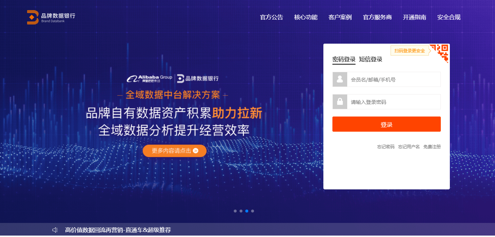

# Introduction {-}

在电商数据行业，我们总是想方设法地洞察消费者心理

## 数据平台和功能模块 {-} 

本手册主要按照以下2个平台和平台中的功能模块（数据银行有7大模块，策略中心有）来介绍:

- 数据银行:

    1. 消费者分析
    2. 全链路分布
    3. 链路流转分析
    4. 会员粉丝分析
    6. 自定义分析
    7. 营销活动沉淀
    8. 数据融合
    9. 数据应用
    10. 数据应用市场

- 策略中心:

    1. 市场概览
    2. 市场细分
    3. 消费者细分
    4. 相关性分析
    5. 消费路径分析
    6. 品类偏好分析
    7. 内容分析
    8. 品牌渗透追踪
    9. 品牌得失追踪
    10. 产品追踪
    
模块介绍请前往数据银行[品牌类目信息管理](https://databank.open.taobao.com/docs/doc.htm?docType=1&articleId=106592&treeId=336&platformId=46#s6)和策略中心[产品使用手册](https://strategy.tmall.com/docs/315)的官方帮助文档。
  
  

首先,你必须**登录**你的品牌账号，才能使用以上模块的功能。 不是所有品牌都会开通策略中心。

## 怎么来看这份手册 {-} 

如何来学习📝:

* 数据银行和策略中心面板上的消费者分析、自定义分析等模块中的各级选项、产品类目和时间维度，都会进行分条介绍。
  
* 重点不在于罗列消费者分析、自定义分析等所需功能，对这些模块的名称和功能进行刻意记忆会增加数据分析过程的枯燥感。在介绍后面会附上相应的使用说明。
  
* 提供案例进一步介绍这些功能可以实现的分析和洞察。

如果你已熟知这些功能，大可略过在网上就可以搜到的介绍，直接阅读和操练后面的案例。实践是最好的学习方式。

## 期待 {-} 

许多主题未能覆盖。。。

## Acknowledgements {-}

xoxoxoxoxoxo

